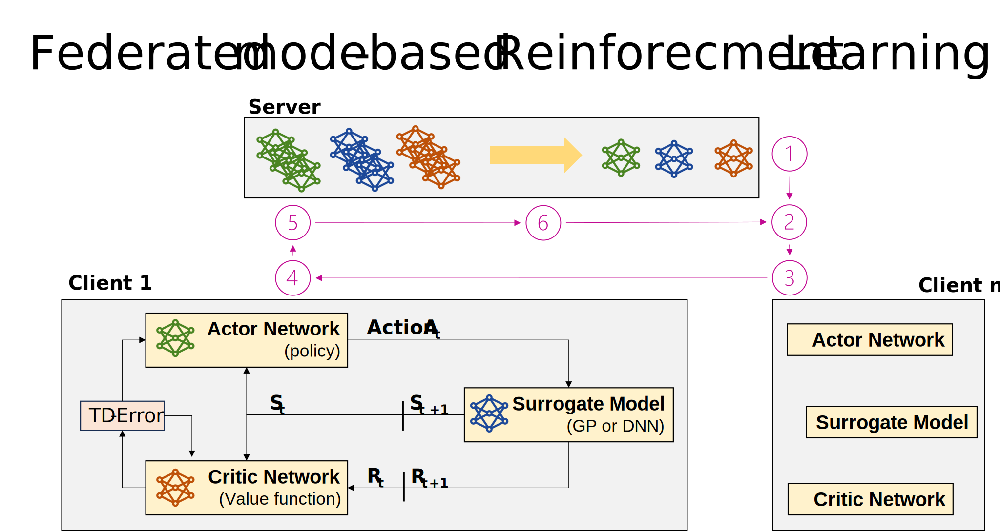

# Federated-Reinforcement-Learning-for-Battery-Charging



> **Abstract:**
> *The energy transition and the associated expansion of renewable energy resources are increasingly challenging the energy system due to their volatile and intermittent nature. In this context, energy management systems play a central role in monitoring and forecasting energy flows. One way to automatically optimise energy flows is reinforcement learning. Here, learning agents are trained on smart meter data and are rewarded for desired behaviours and punished for undesired ones. However, using smart meter data for load forecasting is challenging due to privacy requirements. One solution to improve privacy is federated learning, where data is kept private and only the trained machine learning models are merged and updated on a global server. Therefore, we present a federated learning approach using reinforcement learning to predict the most efficient charging strategy for a battery storage system based on an electrical load profile, a PV system and dynamic electricity prices.*
<br />

### Project structure
This repsoitory consists of the following parts: 
- **data** folder: Here are all datasets and scripts to collect the datasets, preprocess them, performe feature engineering and create the final dataset used for the forecasting task.
- **evaluations** folder: Here are all the evaluation results stored
- **images** folder: Here are all figures and plots stored and the script to create them
- **models** folder: Here the model weights are stored
- **src** folder: Here the main scripts are stored for the forecasting baseline, local learning, federated learning and evaluation
  - **utils** folder: Here helper classes for data handling, model generation, and model handling are stored


### Install and Run the project 
To run the project you can fork this repository and following the instructions: 
First create your own virtual environment: 
```
python -m venv .venv
```
Activate your environment with
```
 .\.venv\Scripts\activate.ps1
```
Install all dependencies with
```
pip install -r requirements.txt
```
